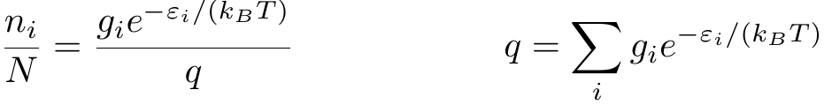
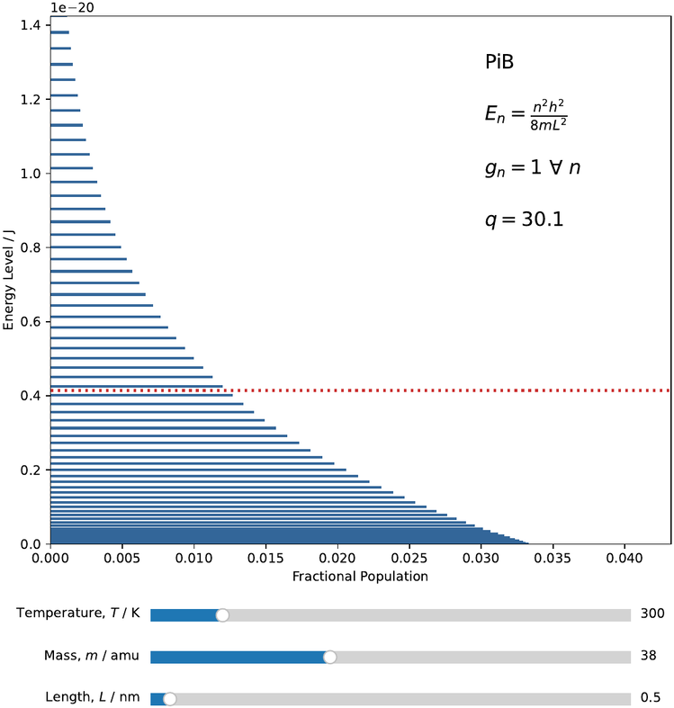
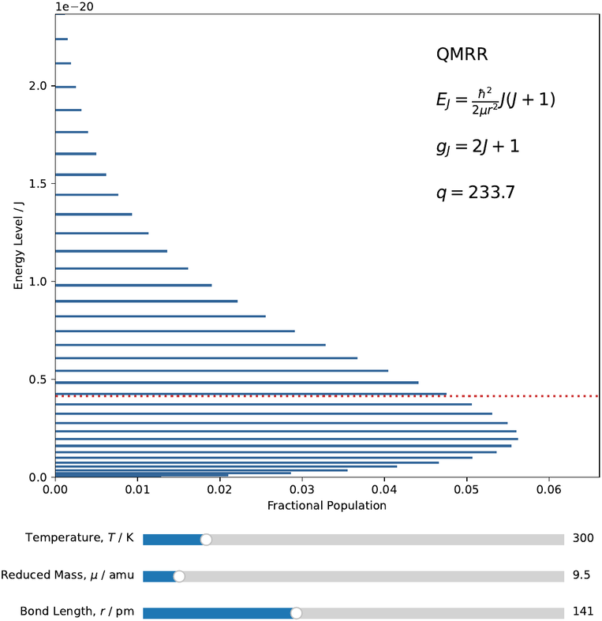
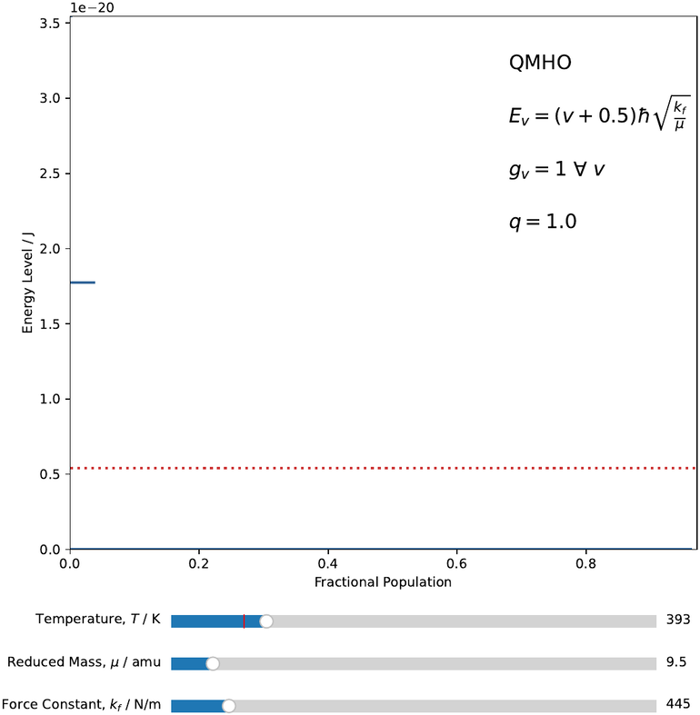

# Boltzmann Visualization

`boltzmann.py` plots the Boltzmann distribution:

for the following quantum models of molecular motion of a diatomic molecule:

* Particle in a 1D Box (PiB)
* Quantum Mechanical Rigid Rotator (QMRR)
* Quantum Mechanical Harmonic Oscillator (QMHO)

Use the sliders to visualize how the distribution changes with temperature and molecular constants.
The dashed red line shows the average energy (kBT) and the partition function, q, is displayed.

## Examples
Diatomic fluorine is used for initial parameters.

